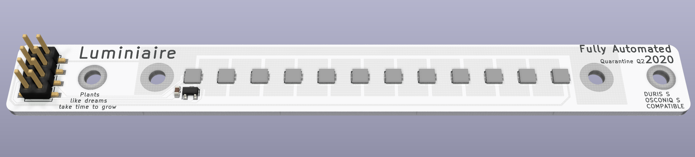

# Luminiaire

Small, efficient and cost-effective lights for small scale vertical farming and horticulture research.

## LED boards

The LED boards mount on a 100mm extruded aluminium heatsink (e.g. [SK 81](https://www.fischerelektronik.de/web_fischer/en_GB/heatsinks/A01/Standard%20extruded%20heatsinks/$catalogue/fischerData/PR/SK81_/search.xhtml) or [SK 92](https://www.fischerelektronik.de/web_fischer/en_GB/heatsinks/A01/Standard%20extruded%20heatsinks/$catalogue/fischerData/PG/SK92/search.xhtml)).

## Controller

TODO
